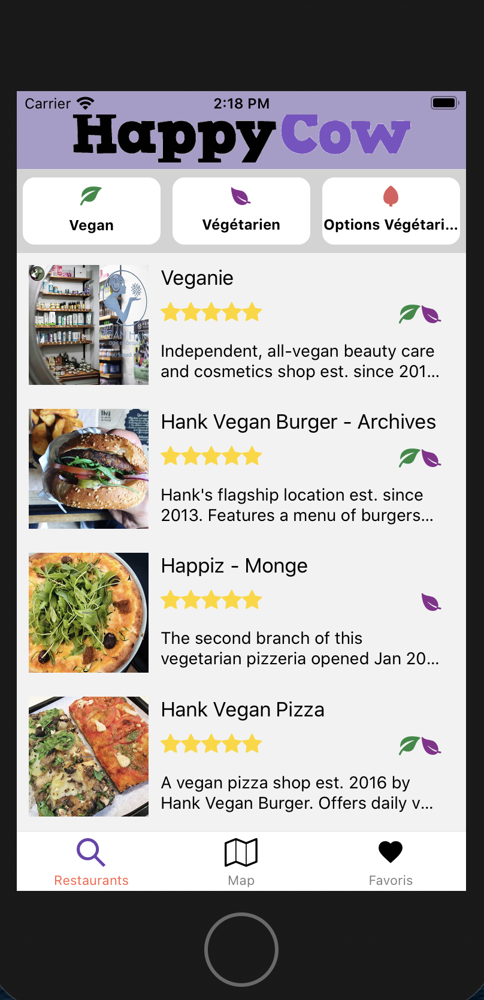
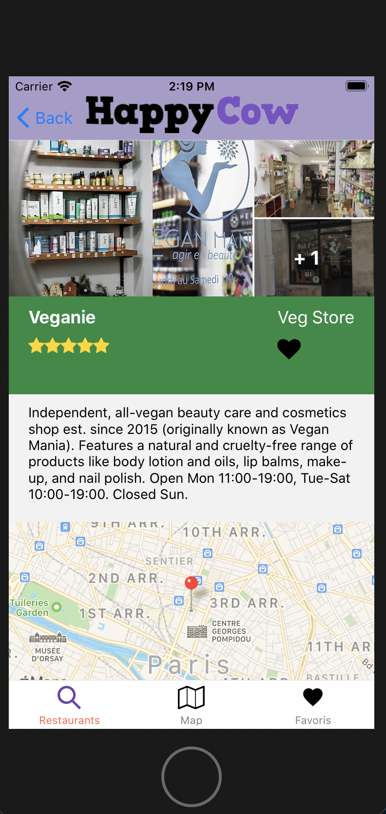
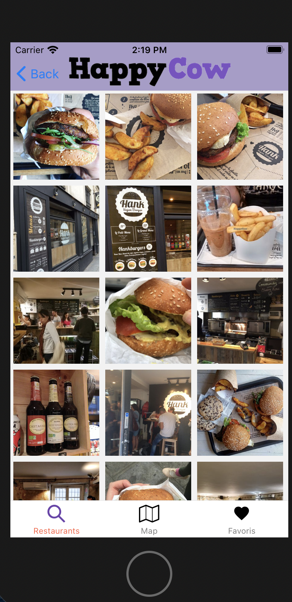
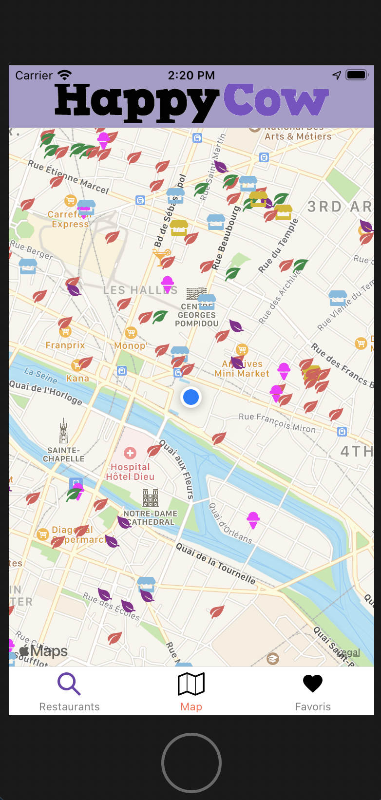

# Happy_Cow_React_Native

## Overview

Projet de fin e formation au Réacteur. Il s'agit d'une copie de l'application Happy Cow sur React Native avec plusieurs pages : la page d'accueil recense la liste tous les restaurants Vegan ou Végétariens de Paris, avec un filtre en fonction de leur nature; lien vers les pages individuelles descriptives des restaurants; lien vers un diaporama par restaurant; page de géolocalisation des restaurants; page pour gérer les favoris.

## Screenshots

 </img>
 </img>
 </img>
 </img>

## Packages

- [React Navigation v5](https://reactnavigation.org/)
- [Expo ActionSheet](https://github.com/expo/react-native-action-sheet)
- [KeyboardAwareScrollView](https://github.com/APSL/react-native-keyboard-aware-scroll-view)
- [React Native Snap Carousel](https://github.com/archriss/react-native-snap-carousel)
- [React Native Maps](https://github.com/react-native-community/react-native-maps)
- [Axios](https://github.com/axios/axios)

## Installation and usage

Be sure, you have installed all dependencies and applications to run React Native Expo project on your computer : [Getting Started with React Native](https://facebook.github.io/react-native/docs/getting-started).

This project works pretty fine for iOS **and** Android.

### Running the project

Install packages :

```
npm install
```

or

```
yarn
```

When installation is complete :

```bash
expo start
```
